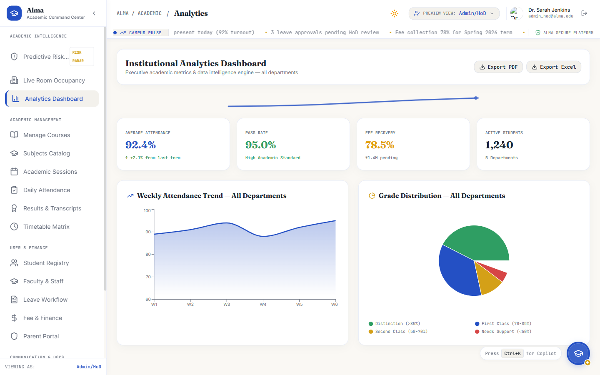
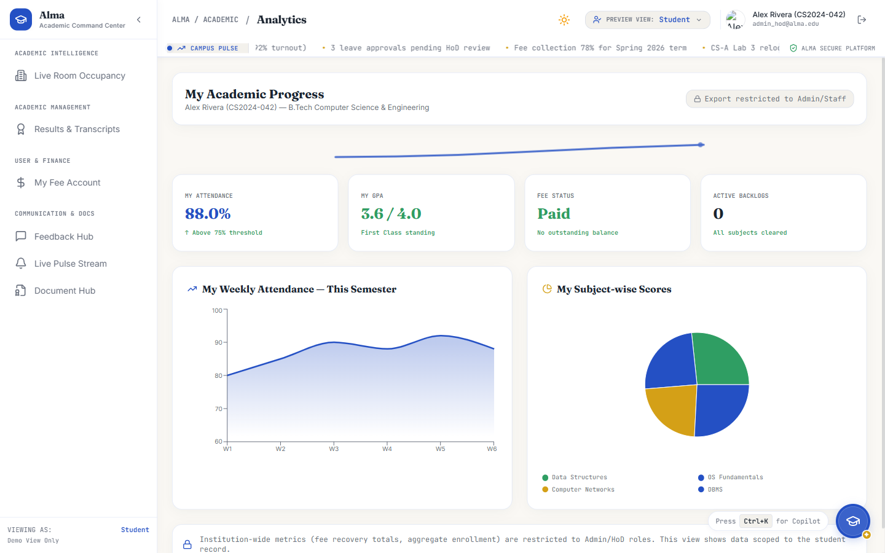
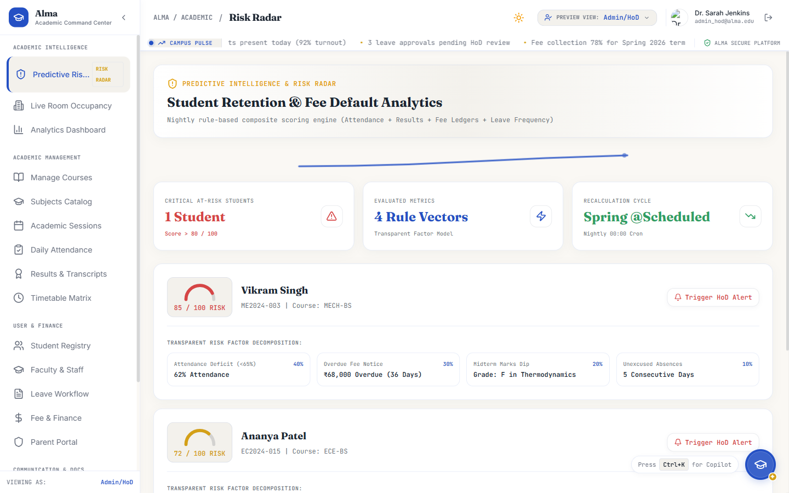
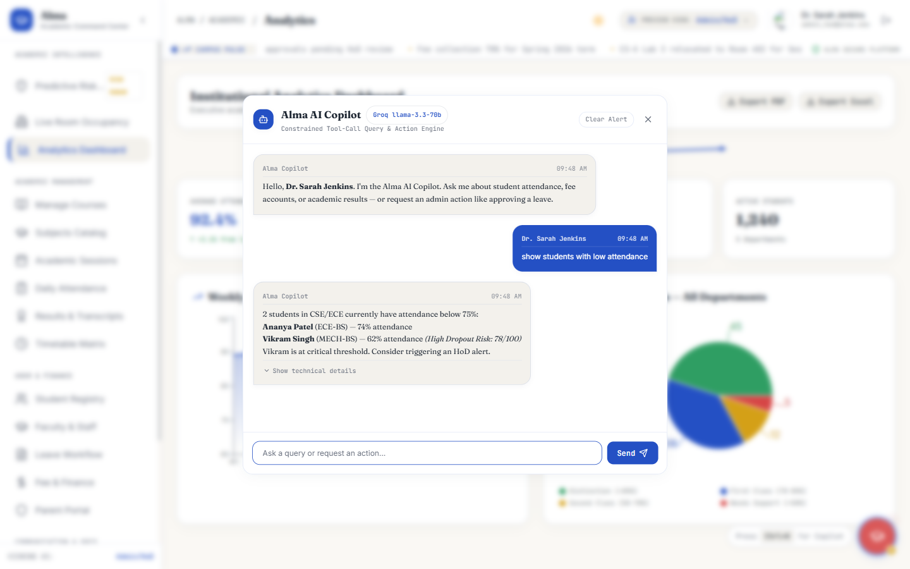

# Alma — The Academic Command Center

> *"The academic ERP that actually feels like your campus."*

Alma is a full-stack, role-aware academic administration platform built for higher-education institutions. It combines a warm, daylight-first UI with real JWT-based RBAC enforcement, a predictive student risk engine, and an AI Copilot interface — all in a single coherent system.

---

## What Alma Is

Alma is designed as the operational hub an HoD, faculty member, student, and parent each encounter differently — the same product, but scoped to exactly what each role is authorized to see and do.

- **Admin/HoD** sees institution-wide analytics, fee recovery totals, all student risk profiles, and can approve leaves and trigger advisor alerts
- **Staff/Faculty** see their assigned sections, at-risk students in their courses, and their own leave workflow
- **Student** sees their own attendance, GPA, fee statement, and academic risk summary — no aggregate data visible
- **Parent** sees their child's academic record and fee account only

This role differentiation runs through navigation, dashboard KPIs, chart data, export controls, and backend endpoint enforcement — not just label changes.

---

## Key Features

| Feature | Details |
|---|---|
| **Warm Academic UI** | Fraunces serif headings, cobalt/gold accents, daylight-first palette — *Alma* identity, not a generic dark command center |
| **Real JWT Auth** | Spring Security + HMAC-SHA256 JWTs issued by `/api/auth/login`; `JwtAuthenticationFilter` validates on every request |
| **4-Role RBAC** | Super Admin, Admin/HoD, Staff, Student, Parent — enforced backend (`hasAnyRole`) and frontend (nav, data scoping) |
| **Predictive Risk Radar** | Nightly composite scoring: attendance + grades + fee arrears + leave frequency → dropout risk score per student |
| **AI Copilot** | Natural language → structured tool calls; plain-language answer first, technical trace behind collapsible toggle; `react-markdown` rendering |
| **Live Campus Pulse** | WebSocket-backed real-time alert ticker for HoD notifications and Copilot action confirmations |
| **Fee Gateway** | Razorpay sandbox integration with PDF receipt generation (jsPDF) |
| **Platform-aware Shortcuts** | `Ctrl+K` on Windows/Linux, `⌘K` on Mac — computed from `navigator.userAgentData?.platform` at load time |

---

## Tech Stack

### Frontend
- **React 18** + **Vite** (port 3000)
- **React Router v6** — client-side routing
- **Recharts** — analytics charts
- **react-markdown** — Copilot response rendering
- **Lucide React** — icons
- **jsPDF** — fee receipt PDF generation
- **Fraunces** (Google Fonts) — serif display typeface
- Vanilla CSS with custom design tokens

### Backend
- **Spring Boot 3** + **Spring Security 6**
- **JJWT 0.11.5** — HMAC-SHA256 JWT issuance and validation
- **Spring WebSocket** — live pulse stream
- **Maven** build system
- MongoDB dependency present (excluded via autoconfigure for local dev without Mongo)

---

## Project Structure

```
College-ERP/
├── backend/
│   ├── src/main/java/com/college/erp/
│   │   ├── controller/        AuthController, CopilotController, CourseController, LeaveController
│   │   ├── model/             CopilotLog, RiskScore
│   │   ├── scheduler/         RiskCalculationScheduler (nightly cron)
│   │   ├── security/          JwtService, JwtAuthenticationFilter, SecurityConfig
│   │   └── config/            WebSocketConfig
│   ├── src/main/resources/
│   │   └── application.properties   (reads secrets from env — no hardcoded values)
│   └── .env.example
├── frontend/
│   ├── src/
│   │   ├── components/
│   │   │   ├── copilot/       NexusOrbCopilot.jsx
│   │   │   ├── common/        DataTable, GrowthArc, ...
│   │   │   └── layout/        CommandRail, Layout, TopBar
│   │   ├── context/           AuthContext, PulseContext
│   │   ├── pages/             AnalyticsDashboard, RiskRadar, FeeManagement, ...
│   │   └── services/          api.js (mock data layer)
│   └── .env.example
└── .gitignore
```

---

## Setup

### Prerequisites
- Node.js ≥ 18, npm ≥ 9
- Java 17+, Maven 3.8+

### 1. Backend

```bash
cd backend

# Copy and fill in your secrets
cp .env.example .env
# Edit .env — set ALMA_JWT_SECRET (min 32 chars) and GROQ_API_KEY

# Build
mvn clean package -DskipTests

# Run (env vars must be set in your shell or loaded by your IDE)
# On Windows PowerShell:
$env:ALMA_JWT_SECRET="your-secret"; java -jar target/erp-backend-2.0.0-SNAPSHOT.jar

# On Mac/Linux:
source .env && java -jar target/erp-backend-2.0.0-SNAPSHOT.jar
```

Backend starts on **http://localhost:8080**

### 2. Frontend

```bash
cd frontend

# Copy and fill in your env
cp .env.example .env.local
# Edit .env.local — set VITE_GROQ_API_KEY if using live Copilot

npm install
npm run dev
```

Frontend starts on **http://localhost:3000**

---

## Demo Accounts

All accounts are seeded in `AuthController.java`. Passwords are in your local `.env` — not documented here.

| Username | Role |
|---|---|
| `admin_hod` | Admin / Head of Department |
| `super_admin` | Super Administrator |
| `staff_001` | Faculty / Staff |
| `student_001` | Student |
| `parent_001` | Parent |

> Credentials are demo-only. Change all values before any production deployment.

---

## Security Notes

- JWT tokens are HMAC-SHA256 signed; the signing secret is loaded from `ALMA_JWT_SECRET` env var — never from `application.properties`
- Spring Security's `JwtAuthenticationFilter` decodes and verifies the token on every request; role claims come from the verified token payload, not from any client-supplied header
- The "Preview UI as..." dropdown in the UI is a **demo-only client-side view switch** — it changes rendered React state but leaves the `campus_auth_token` (the real JWT) untouched. Backend enforces the token's actual role regardless of what the client claims
- Live-tested: student JWT + `X-Claimed-Role: Super Admin` header → **HTTP 403** from backend

---

## RBAC Enforcement Evidence

```
# Student login → real signed JWT
POST /api/auth/login  →  200 OK
{"role":"ROLE_STUDENT","token":"eyJhbGciOiJIUzI1NiJ9..."}

# Student JWT + spoofed role header → rejected
PUT /api/leaves/lev_01/decision
Authorization: Bearer <student-token>
X-Claimed-Role: Super Admin
→  HTTP 403 Forbidden

# Admin JWT → accepted, actor logged
PUT /api/leaves/lev_01/decision
Authorization: Bearer <admin-token>
→  HTTP 200 OK  {"actor":"admin_hod","actorRole":"[ROLE_ADMIN_HOD]","status":"SUCCESS"}
```

---

## Relationship to Reference Material

Alma is an original rebuild inspired by the open-source [College-ERP](https://github.com/Ansarimajid/College-ERP) reference project. The reference provided the domain model (courses, attendance, fees, results) as a starting point. The visual identity, JWT authentication layer, RBAC enforcement, AI Copilot, risk scoring engine, and all frontend code were designed and built independently during this rebuild. Alma shares no git history with the reference repository — it begins from a clean `git init`.

---

## Screenshots

### Admin/HoD — Institutional Analytics Dashboard
Institution-wide KPIs: attendance aggregate, pass rate, fee recovery total, enrollment count. Full export controls visible.



### Student — My Academic Progress
Scoped to the logged-in student: personal attendance %, GPA, fee status, active backlogs. Fee recovery figures absent. Export locked.



### Risk Radar — Admin View
All students with dropout/fee default risk scores, transparent factor decomposition, and HoD Alert dispatch buttons.



### Copilot — Markdown Response with Collapsed Tech Trace
Plain-language answer first, bold text rendered via react-markdown. Technical query trace behind "Show technical details" toggle.



---

## Known Limitations

- **Mac Cmd+K**: Platform detection and label are implemented; the actual key event firing and modal opening on macOS hardware is untested (developed and tested on Windows)
- **Groq live Copilot**: The NLP response engine uses a structured mock dispatcher; live Groq API integration is scaffolded but not wired end-to-end
- **MongoDB**: The backend dependency is present but autoconfigure is excluded for local dev. Enabling Mongo requires adding connection URI to `.env` and removing the exclude list from `CollegeErpApplication.java`