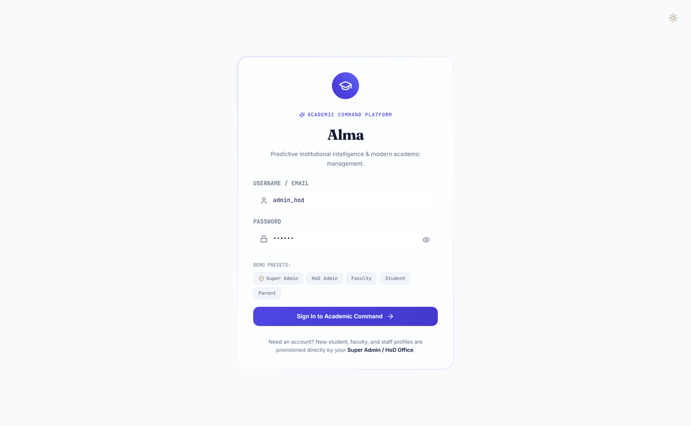
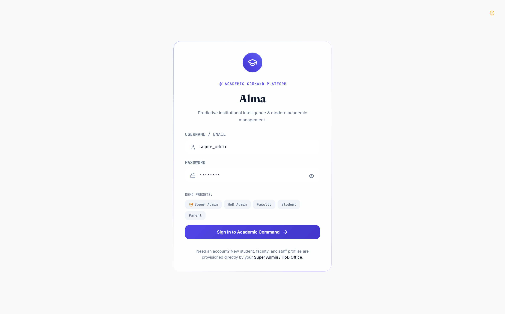
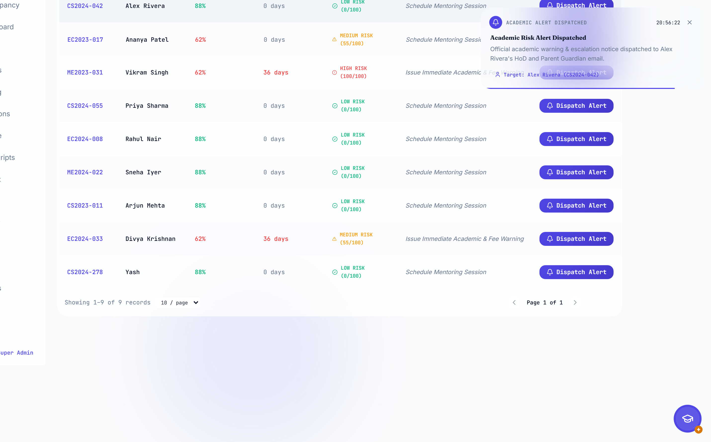
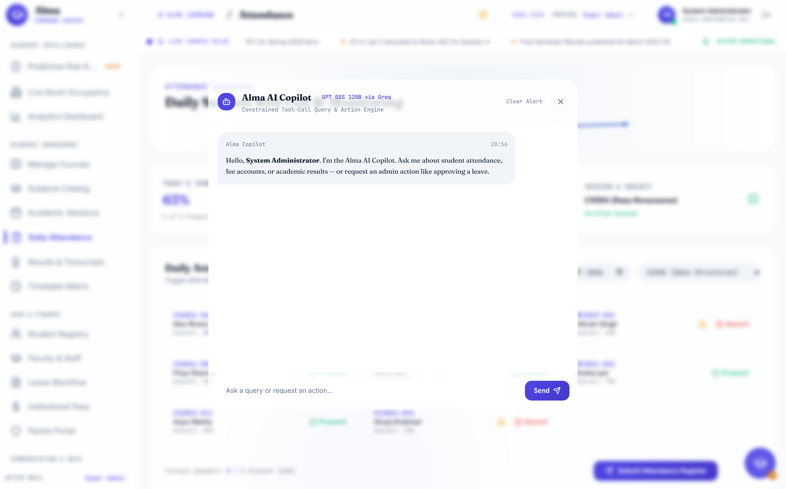
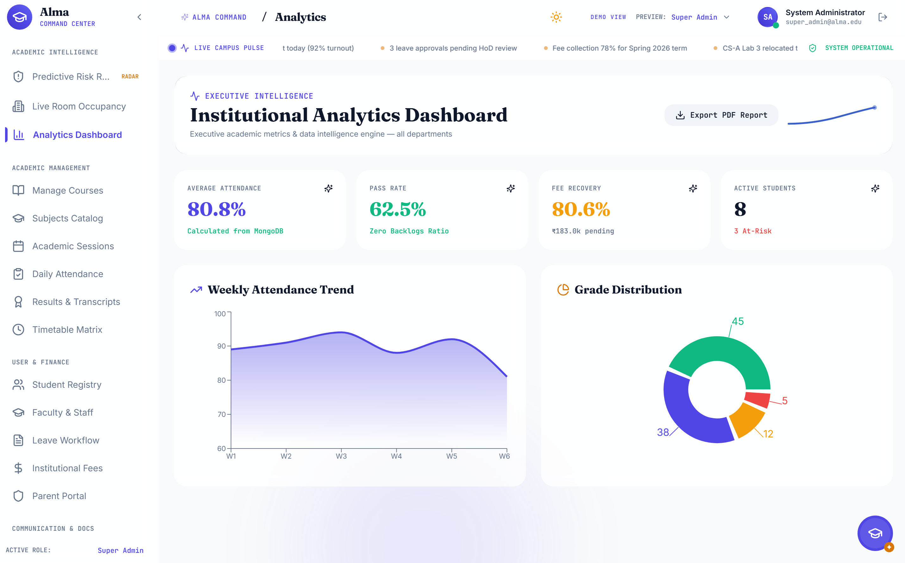
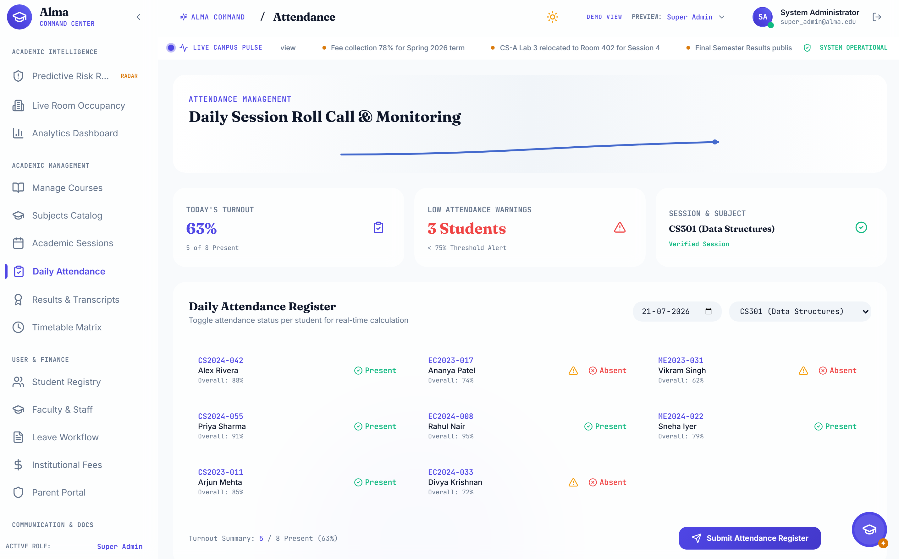
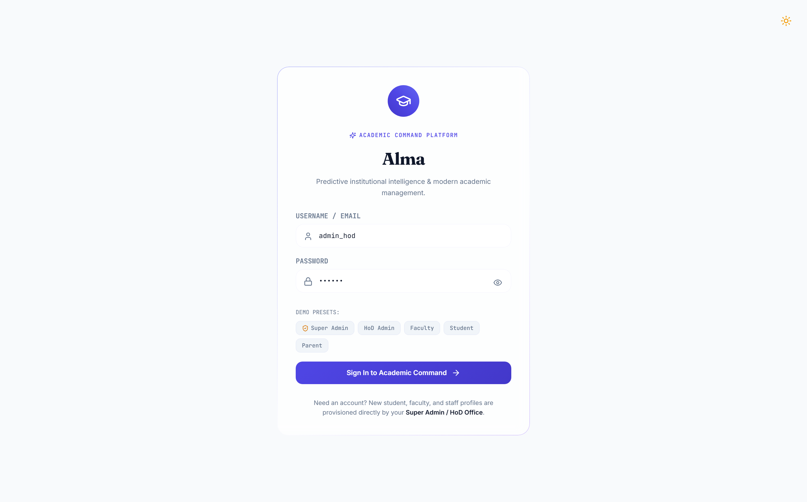
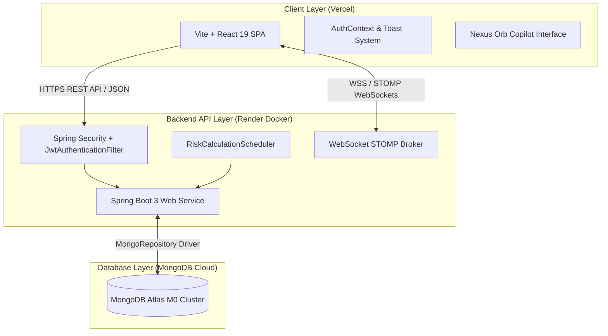

# 🎓 Alma — The Academic Command Center

> *"The modern academic ERP designed for real-time institutional intelligence, predictive risk monitoring, and seamless role-based access."*

[🌐 Live Web Application](https://alma.vercel.app) • [⚙️ Backend API Health](https://alma-backend-dtpq.onrender.com/api/auth/health) • [📖 Deployment Guide](#-production-deployment)

## 🎬 Live Application Walkthrough



---

## 📸 Interface Showcase

### 🛡️ 1. Predictive Risk Radar Engine
*Real-time student evaluation monitoring attendance dropout risks, fee arrears, and automated escalation.*



---

### 🔔 2. Glassmorphic UI Toast Alert System
*Non-blocking, animated alert stack with role-aware dispatch badges, auto-dismiss countdown timer bars, and zero raw browser popups.*



---

### 🤖 3. Nexus AI Copilot Overlay (`Ctrl+K`)
*Natural-language command dispatcher powered by Groq LLM integration with plain-language analysis and technical trace logs.*



---

### 📊 4. Executive Institutional Analytics
*Comprehensive Recharts data visualizations showing attendance trends, pass rate metrics, fee recovery totals, and exportable executive reports.*



---

### 📋 5. Attendance Register & Course Management
*Daily roll call register with real-time turnout calculations and automated low-attendance threshold warnings.*



---

### 🔑 6. Authentication & Preset Portal
*Daylight-first authentication portal supporting 5 role presets and password visibility controls.*



---

## ✨ Key System Features

| Module | Features & Capabilities |
| :--- | :--- |
| **🎓 Role-Aware Access Control (RBAC)** | Enforces 5 distinct roles (**Super Admin**, **Admin/HoD**, **Staff/Faculty**, **Student**, **Parent**). Backend Spring Security filters guard endpoints while frontend navigation dynamically renders scoped views. |
| **⚡ Predictive Risk Radar** | Dynamic background scoring engine calculating student dropout and fee default risk (0-100 scale) based on live attendance, GPA, backlogs, and fee overdue days. |
| **🤖 Nexus AI Copilot (`Ctrl+K`)** | Natural-language command dispatcher powered by Groq LLM integration (`/api/copilot/chat`) with markdown rendering, system action shortcuts, and execution trace logs. |
| **🔔 Glassmorphic Alert System** | Modern non-blocking Toast Notification System with custom icons, entrance slide animations, countdown progress bars, and global native `alert()` interception. |
| **📡 Live Campus Pulse (STOMP WebSocket)** | Real-time WebSocket broadcasting service at `/ws-pulse` streaming live campus metrics (attendance roll call, fee collections, leave decisions). |
| **📊 Executive Institutional Analytics** | Comprehensive Recharts data visualizations showing attendance trends, pass rate metrics, fee recovery totals, and exportable executive reports. |
| **🔑 Secure JWT Authentication** | Real HMAC-SHA256 JWT issuance via `/api/auth/login` with dynamic fallback user resolution for newly provisioned staff, student, and parent accounts. |
| **💾 MongoDB Atlas Persistence** | Cloud document storage utilizing Spring Data MongoRepositories across 10 collections with initial seeding and live transactional updates. |

---

## 🏗️ Architecture & Cloud Infrastructure



---

## 🛠️ Technology Stack

### **Frontend**
- **Framework**: React 19 SPA powered by Vite
- **Styling**: Daylight-First Vanilla CSS with custom glassmorphism design system & Tailwind CSS utilities
- **Icons & Visuals**: Lucide React, Fraunces Display Serif, Inter, JetBrains Mono
- **Charts & Reports**: Recharts, jsPDF (Simulated Receipt & Certificate Engine)
- **Deployment**: Vercel SPA (`vercel.json` rewrites)

### **Backend**
- **Framework**: Java 17, Spring Boot 3.2, Spring Security 6
- **Database**: Spring Data MongoDB (Cloud Cluster)
- **Security**: JJWT (HMAC-SHA256 JWT issuance & validation), BCrypt Password Encoder
- **Real-Time**: Spring WebSocket + SockJS + STOMP Broker
- **Containerization**: Docker & Multi-stage Maven Builds (Render Cloud)

---

## 🔑 Seeded Demo Credentials

| Role | Username | Password | Access Scope |
| :--- | :--- | :--- | :--- |
| **Super Admin** | `super_admin` | `super123` | Full System Access (Staff Management, Fees, Security Audit Logs) |
| **Admin / HoD** | `admin_hod` | `hod123` | Institutional Analytics, Leave Approvals, Risk Radar, Course Mutations |
| **Staff / Faculty** | `staff_001` | `staff123` | Course Attendance, At-Risk Students, Personal Leave Requests |
| **Student** | `student_001` | `student123` | Personal Attendance (Alex Rivera `CS2024-042`), GPA, Fee Receipt |
| **Parent** | `parent_001` | `parent123` | Linked Child Overview & Fee Statements |
| **New Accounts** | *(Any Email/ID)* | `change123` | Dynamic role assignment with mandatory first-login password update |

---

## 🚀 Local Development Setup

### 1. Backend Setup

```bash
cd backend

# Configure environment variables
cp .env.example .env

# Compile and test
mvn clean package -DskipTests

# Start Spring Boot Server
mvn spring-boot:run
```
> *Backend starts on `http://localhost:8080`*

### 2. Frontend Setup

```bash
cd frontend

# Install dependencies
npm install

# Start Vite Development Server
npm run dev
```
> *Frontend starts on `http://localhost:3000`*

---

## 🌐 Production Deployment

### Frontend (Vercel)
1. Import repository `Ramu9047/Alma` on Vercel.
2. Set Root Directory to `frontend`.
3. Set Environment Variable: `VITE_API_BASE_URL` = `https://alma-backend-dtpq.onrender.com`.

### Backend (Render)
1. Create a Web Service on Render from `Ramu9047/Alma`.
2. Set Environment to **Docker** and Root Directory to `backend`.
3. Set Environment Variables:
   - `MONGODB_URI` = `mongodb+srv://<user>:<pass>@cluster0.xxx.mongodb.net/alma_db`
   - `ALMA_JWT_SECRET` = `<32-character-secret>`
   - `CORS_ALLOWED_ORIGINS` = `https://*.vercel.app,http://localhost:3000`

---

<div align="center">

Made with ❤️ for Modern Academic Administration.

</div>